# 一 Flex 布局介绍

## 1.1 什么是Flex布局

```python
# 1 布局的传统解决方案，基于盒状模型，依赖 display 属性 + position 属性 + float 属性。它对于那些特殊布局非常不方便，比如，垂直居中就不容易实现

# 2 Flex 是  Flexible Box 或 flexbox 的缩写，意为"弹性布局"，用来为盒状模型提供最大的灵活性

# 3 任何一个容器都可以指定为 Flex 布局。

.box{  
    display: flex;
}

# 4 行内元素也可以使用 Flex 布局。

.box{  
    display: inline-flex;
}
```

## 1.2 flex布局的好处

```python
#1 简单易懂：与传统的布局方式相比，Flex布局的语法和理解起来更加简单，容易上手。
#2 弹性和自适应：Flex布局能够自动适应不同尺寸的屏幕，让页面更具有弹性。
#3 等高布局：Flex布局可以方便地实现多列等高布局。
#4 对齐和排序：Flex布局支持各种对齐方式，包括水平和垂直对齐，并且可以通过设置order属性对子元素进行排序。
#5 可以与传统布局结合使用：Flex布局并不是完全取代传统的布局方式，它可以与传统布局方式结合使用，实现更灵活的布局效果
```

## 1.3 概念

```python
# 1  采用 Flex 布局的元素，称为 Flex 容器（flex container），简称"容器"。它的所有子元素自动成为容器成员，称为 Flex 项目（flex item），简称"项目"
	-容器和项目：container、item

# 2 容器默认存在两根轴：水平的主轴（main axis）和垂直的交叉轴（cross axis）
	-主轴和交叉轴：main axis、cross axis(主轴不一定是横向的也可以竖着)
# 3 主轴的开始位置（与边框的交叉点）叫做main start，结束位置叫做main end；交叉轴的开始位置叫做cross start，结束位置叫做cross end。
	-起始位置：
    	main start 主轴起始位置
        cross start 侧轴起始位置
    -结束位置：
    	main end 主轴结束位置
        cross start 侧轴结束位置
# 4 项目默认沿主轴排列。单个项目占据的主轴空间叫做main size，占据的交叉轴空间叫做cross size
	-主轴尺寸
    -侧轴尺寸
    
```

![[Pasted image 20251228150230.png]]

# 二 容器样式属性(6个，放在container上的)

```python
# 1 flex-direction：决定主轴的方向。
# 2 flex-wrap：如果一条轴线排不下，如何换行。
# 3 flex-flow：flex-direction 属性和 flex-wrap 属性的简写属性。
# 4 justify-content：定义项目在主轴上的对齐方式。
# 5 align-items：定义项目在交叉轴上如何对齐。
# 6 align-content：定义了多根轴线的对齐方式。如果项目只有一根轴线，该属性不起作用。（即只有项目换了行，才起作用，）
```


## 2.1 flex-direction

```python
# 1 flex-direction属性决定主轴的方向（即项目的排列方向）
# 2 有4个值（如下图）
row（默认值）：主轴为水平方向，起点在左端。
row-reverse：主轴为水平方向，起点在右端。
column：主轴为垂直方向，起点在上沿。
column-reverse：主轴为垂直方向，起点在下沿。

# 3 强调：使用 flex-direction属性后，因为主轴的位置发生了改变，使用和主轴或交叉轴有关的属性之前一定要确定好主轴的位置
```

![[Pasted image 20251228150944.png]]

```html
<!DOCTYPE html>
<html lang="en">
<head>
    <meta charset="UTF-8">
    <title>Title</title>
     <style>
        .box {
            width: 800px;
            height: 400px;
            border: 1px solid black;
            margin: auto; /* box 居中*/
            /* 使用弹性布局 */
            display: flex;
            /* row（默认值）：主轴为水平方向，起点在左端。 */
            flex-direction: row; /*  row-reverse    column    column-reverse */
        }

        .box div {
            width: 100px;
            height: 100px;
            background-color: pink;
            border: 1px solid red;

        }
    </style>
</head>
<body>
<div class="box">
        <div>1</div>
        <div>2</div>
        <div>3</div>
        <div>4</div>
        <div>5</div>
        <div>6</div>

    </div>
</body>
</html>
```


## 2.2 flex-wrap

```python
# 1 默认情况下，项目都排在一条线（又称"轴线"）上。flex-wrap属性定义，如果一条轴线排不下，如何换行。

# 2 flex-wrap 属性规定flex容器是单行或者多行，同时横轴的方向决定了新行堆叠的方向

# 3 3个值 flex-wrap: nowrap | wrap | wrap-reverse;
	- nowrap 不换行
    - wrap 换行，第一行在上方
    - wrap-reverse 换行，第一行在下方
```

```html
<!DOCTYPE html>
<html lang="en">
<head>
    <meta charset="UTF-8">
    <title>Title</title>
     <style>
        .box {
            width: 800px;
            height: 400px;
            border: 1px solid black;
            margin: auto; /* box 居中*/
            /* 使用弹性布局 */
            display: flex;
            /* row（默认值）：主轴为水平方向，起点在左端。 */
            flex-direction: row;
            /*flex-wrap: nowrap;  nowrap 默认值 */
            /*flex-wrap: wrap; /* wrap 换行，第一行在上方 */
            flex-wrap: wrap-reverse; /* wrap-reverse 换行，第一行在下方 */
        }

        .box div {
            width: 100px;
            height: 100px;
            background-color: pink;
            border: 1px solid red;

        }
    </style>
</head>
<body>
<div class="box">
        <div>1</div>
        <div>2</div>
        <div>3</div>
        <div>4</div>
        <div>5</div>
        <div>6</div>
        <div>7</div>
        <div>8</div>
        <div>9</div>

    </div>
</body>
</html>
```


## 2.3 flex-flow

```python
# 1 flex-flow属性是flex-direction属性和flex-wrap属性的简写形式，默认值为row nowrap。

.box {  
    flex-flow: flex-direction || flex-wrap;
}
```


```html
<!DOCTYPE html>
<html lang="en">
<head>
    <meta charset="UTF-8">
    <title>Title</title>
     <style>
        .box {
            width: 800px;
            height: 400px;
            border: 1px solid black;
            margin: auto; /* box 居中*/
            /* 使用弹性布局 */
            display: flex;
            /*flex-flow: row nowrap;*/
            flex-flow: column wrap;
            /*flex-flow: row nowrap;*/
        }

        .box div {
            width: 100px;
            height: 100px;
            background-color: pink;
            border: 1px solid red;

        }
    </style>
</head>
<body>
<div class="box">
        <div>1</div>
        <div>2</div>
        <div>3</div>
        <div>4</div>
        <div>5</div>
        <div>6</div>
        <div>7</div>
        <div>8</div>
        <div>9</div>

    </div>
</body>
</html>
```


## 2.4 justify-content

```python
# 1 justify-content属性定义了项目(item)在主轴上的对齐方式
# 2  6个值，具体对齐方式与轴的方向有关。下面假设主轴为从左到右
justify-content: flex-start | flex-end | center | space-between | space-around | space-evenly;
    
    flex-start（默认值）：左对齐
    flex-end：右对齐
    center： 居中
    space-between：两端对齐，项目之间的间隔都相等。
    space-around：每个项目两侧的间隔相等。所以，项目之间的间隔比项目与边框的间隔大一倍。
    space-evenly：项目与项目之间，项目与边框之间的间隔都相等
```

### 2.4.1 justify-content: flex-start(左对齐:默认值)

![[Pasted image 20251228153950.png]]

```html
<!DOCTYPE html>
<html lang="en">
<head>
    <meta charset="UTF-8">
    <title>Title</title>
    <style>
        .box {
            width: 800px;
            height: 400px;
            border: 1px solid black;
            margin: auto; /* box 居中*/
            /* 使用弹性布局 */
            display: flex;
            flex-flow: row wrap;
            justify-content: flex-start
        }

        .box div {
            width: 100px;
            height: 100px;
            background-color: pink;
            border: 1px solid red;

        }
    </style>
</head>
<body>
<div class="box">
    <div>1</div>
    <div>2</div>
    <div>3</div>

</div>
</body>
</html>
```

### 2.4.2 justify-content: flex-end;右对齐

![[Pasted image 20251228154017.png]]


### 2.4.3 justify-content: center; 居中

![[Pasted image 20251228154044.png]]

### 2.4.4 justify-content: space-between;两端对齐，项目之间的间隔都相等,但是项目贴着容器

![[Pasted image 20251228154114.png]]

### 2.4.5 justify-content: space-around;每个项目两侧的间隔相等。所以，项目之间的间隔比项目与边框的间隔大一倍

![[Pasted image 20251228154150.png]]

### 2.4.6 justify-content: space-evenly;项目与项目之间，项目与边框之间的间隔都相等

![[Pasted image 20251228154217.png]]


```html
<!DOCTYPE html>
<html lang="en">
<head>
    <meta charset="UTF-8">
    <title>Title</title>
    <style>
        .box {
            width: 800px;
            height: 400px;
            border: 1px solid black;
            margin: auto; /* box 居中*/
            /* 使用弹性布局 */
            display: flex;
            flex-flow: row wrap;
            justify-content: flex-start;/* 左对齐 */
            justify-content: flex-end;/* 右对齐 */
            justify-content: center;/* 居中 */
            justify-content: space-between;/* 两端对齐，项目之间的间隔都相等 */
            justify-content: space-around;/*每个项目两侧的间隔相等。所以，项目之间的间隔比项目与边框的间隔大一倍*/
            justify-content: space-evenly;/*项目与项目之间，项目与边框之间的间隔都相等*/
        }

        .box div {
            width: 100px;
            height: 100px;
            background-color: pink;
            border: 1px solid red;

        }
    </style>
</head>
<body>
<div class="box">
    <div>1</div>
    <div>2</div>
    <div>3</div>

</div>
</body>
</html>
```


## 2.5 align-items

```python
# 1 align-items属性定义项目在交叉轴上如何对齐。
# 2 align-items: flex-start | flex-end | center | baseline | stretch   5个值
    flex-start：交叉轴的起点对齐。
    flex-end：交叉轴的终点对齐。
    center：交叉轴的中点对齐。
    baseline：项目的第一行文字的基线对齐。
    stretch（默认值）：如果项目未设置高度或设为 auto，将占满整个容器的高度
```


### 2.5.1 align-items:flex-start;交叉轴的起点对齐

![[Pasted image 20251228154702.png]]

### 2.5.2 align-items:flex-end;交叉轴的终点对齐

![[Pasted image 20251228154753.png]]

### 2.5.3 align-items:center;交叉轴的中点对齐

![[Pasted image 20251228154825.png]]

### 2.5.4 align-items:baseline;项目的第一行文字的基线对齐
文字都是一样高的
![[Pasted image 20251228155500.png]]

```html
    <style>
        .box {
            width: 800px;
            height: 400px;
            border: 1px solid black;
            margin: auto; /* box 居中*/
            /* 使用弹性布局 */
            display: flex;
            flex-flow: row wrap;
            justify-content: flex-start; /* 左对齐 */
            justify-content: flex-end; /* 右对齐 */
            justify-content: center; /* 居中 */
            justify-content: space-between; /* 两端对齐，项目之间的间隔都相等 */
            justify-content: space-around; /*每个项目两侧的间隔相等。所以，项目之间的间隔比项目与边框的间隔大一倍*/
            justify-content: space-evenly; /*项目与项目之间，项目与边框之间的间隔都相等*/

            align-items: flex-start; /*交叉轴的起点对齐*/
            align-items: flex-end; /*交叉轴的终点对齐*/
            align-items: center; /*交叉轴的中点对齐*/
            align-items: baseline; /*项目的第一行文字的基线对齐*/
        }

        .box div {
            width: 100px;
            height: 100px;
            background-color: pink;
            border: 1px solid red;

        }

        .box div:nth-child(1) {
            padding-top: 10px;
        }

        .box div:nth-child(2) {
            padding-top: 15px;
        }

        .box div:nth-child(4) {
            padding-top: 20px;
        }
    </style>


<div class="box">
    <div>1</div>
    <div>2</div>
    <div>3</div>
    <div>4</div>
    <div>5</div>
    <div>6</div>

</div>
```

### 2.5.5 align-items:stretch;（默认值）如果项目未设置高度或设为 auto，将占满整个容器的高度

![[Pasted image 20251228155544.png]]

```html
<!DOCTYPE html>
<html lang="en">
<head>
    <meta charset="UTF-8">
    <title>Title</title>
    <style>
        .box {
            width: 800px;
            height: 400px;
            border: 1px solid black;
            margin: auto; /* box 居中*/
            /* 使用弹性布局 */
            display: flex;
            flex-flow: row wrap;
            justify-content: flex-start; /* 左对齐 */
            justify-content: flex-end; /* 右对齐 */
            justify-content: center; /* 居中 */
            justify-content: space-between; /* 两端对齐，项目之间的间隔都相等 */
            justify-content: space-around; /*每个项目两侧的间隔相等。所以，项目之间的间隔比项目与边框的间隔大一倍*/
            justify-content: space-evenly; /*项目与项目之间，项目与边框之间的间隔都相等*/

            align-items: flex-start; /*交叉轴的起点对齐*/
            align-items: flex-end; /*交叉轴的终点对齐*/
            align-items: center; /*交叉轴的中点对齐*/
            align-items: baseline; /*项目的第一行文字的基线对齐*/
            align-items: stretch;; /*默认值）如果项目未设置高度或设为 auto，将占满整个容器的高度*/
        }

        .box div {
            width: 100px;
            /*height: 100px;*/
            background-color: pink;
            border: 1px solid red;

        }

        .box div:nth-child(1) {
            padding-top: 10px;
        }

        .box div:nth-child(2) {
            padding-top: 15px;
        }

        .box div:nth-child(4) {
            padding-top: 20px;
        }
    </style>
</head>
<body>
<div class="box">
    <div>1</div>
    <div>2</div>
    <div>3</div>
    <div>4</div>
    <div>5</div>
    <div>6</div>

</div>
</body>
</html>
```

## 2.6 align-content属性：定义了多根轴线的对齐方式，如果项目只有一根轴线，该属性不起作用

```python
# 1 align-content属性定义了多根轴线的对齐方式。如果项目只有一根轴线，该属性不起作用。
	-允许项目换行【flex-wrap: wrap】，使用align-content属性的前提，否则align-content属性不生效
# 2 align-content: flex-start | flex-end | center | space-between | space-around | stretch; 6个值
    flex-start：与交叉轴的起点对齐。
    flex-end：与交叉轴的终点对齐。
    center：与交叉轴的中点对齐。
    space-between：与交叉轴两端对齐，轴线之间的间隔平均分布。
    space-around：每根轴线两侧的间隔都相等。所以，轴线之间的间隔比轴线与边框的间隔大一倍。
    stretch（默认值）：轴线占满整个交叉轴。

#3 align-content的属性值和前面的都一样， 只需要注意在使用align-content的属性之前一定要加上 flex-wrap: wrap;属性
```

### 2.6.1 flex-start：与交叉轴的起点对齐

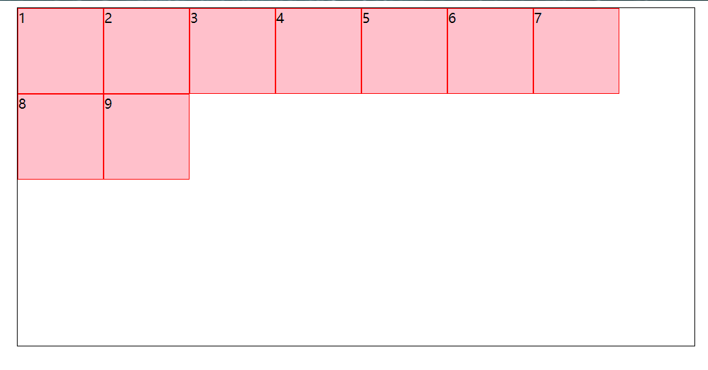

### 2.6.2 flex-end：与交叉轴的终点对齐

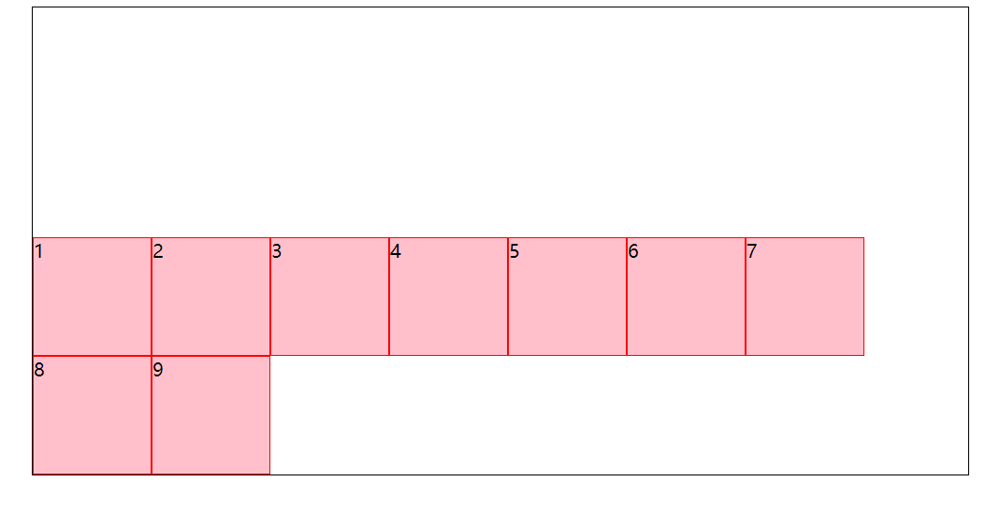


### 2.6.3 center：与交叉轴的中点对齐

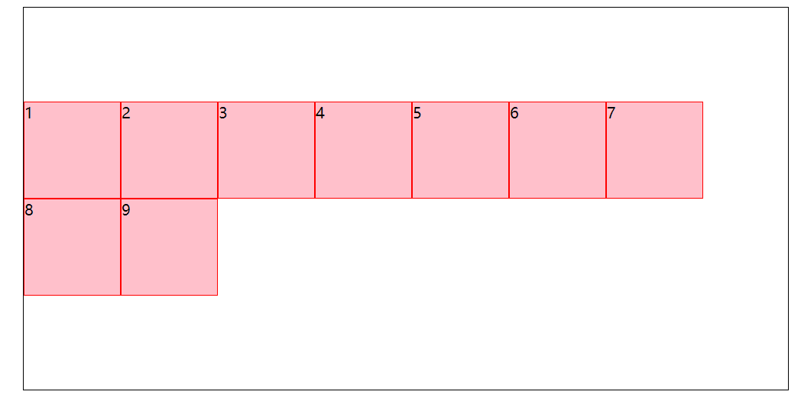

### 2.6.4 space-between：与交叉轴两端对齐，轴线之间的间隔平均分布
他这个是以交叉轴为中心，把横着的两行进行间隔平均分布

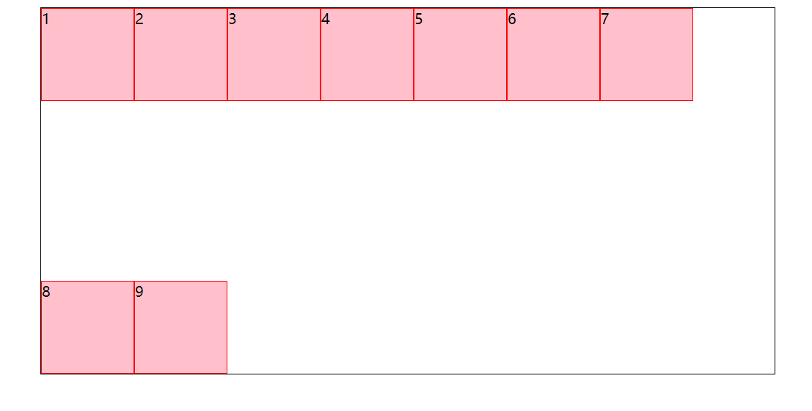

### 2.6.5 space-around：每根轴线两侧的间隔都相等。所以，轴线之间的间隔比轴线与边框的间隔大一倍

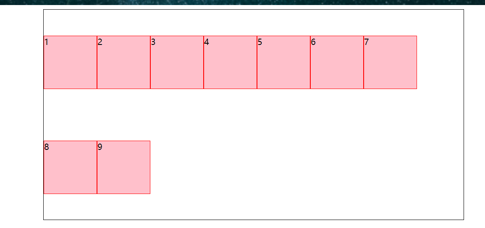

### 2.6.6 stretch（默认值）：轴线占满整个交叉轴

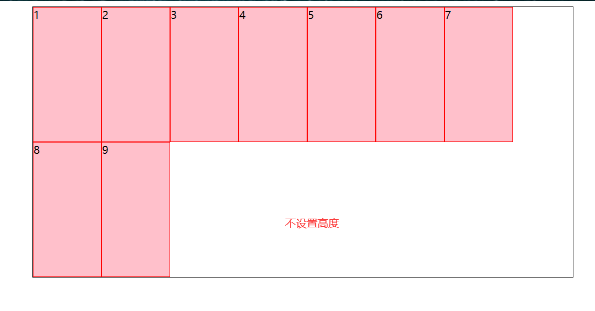

```html
<!DOCTYPE html>
<html lang="en">
<head>
    <meta charset="UTF-8">
    <title>Title</title>
    <style>
        .box {
            width: 800px;
            height: 400px;
            border: 1px solid black;
            margin: auto; /* box 居中*/
            /* 使用弹性布局 */
            display: flex;
            flex-flow: row wrap;

            /* flex-start：与交叉轴的起点对齐。 */
            align-content: flex-start;
            /* flex-end：与交叉轴的终点对齐。 */
            align-content: flex-end;
            /* center：与交叉轴的中点对齐。 */
            align-content: center;
            /* space-between：与交叉轴两端对齐，轴线之间的间隔平均分布。 */
            align-content: space-between;
            /* space-around：每根轴线两侧的间隔都相等。所以，轴线之间的间隔比轴线与边框的间隔大一倍。 */
            align-content: space-around;
             /* stretch（默认值）：轴线占满整个交叉轴。 */
            align-content: stretch;


        }

        .box div {
            width: 100px;
            height: 100px;  /*align-content: stretch  不设置高度*/
            background-color: pink;
            border: 1px solid red;

        }


    </style>
</head>
<body>
<div class="box">
    <div>1</div>
    <div>2</div>
    <div>3</div>
    <div>4</div>
    <div>5</div>
    <div>6</div>
    <div>7</div>
    <div>8</div>
    <div>9</div>

</div>
</body>
</html>
```


# 三 项目样式属性（item的属性，即每个小的div）

```python
#1 以下6个属性设置在项目上。
order：定义项目的排列顺序。数值越小，排列越靠前，默认为 0

flex-grow：定义项目的放大比例，默认为 0，即如果存在剩余空间，也不放大

flex-shrink：定义了项目的缩小比例，默认为 1，即如果空间不足，该项目将缩小

flex-basis：定义了在分配多余空间之前，项目占据的主轴空间（main size）。它的默认值为 auto，即项目的本来大小

flex： flex-grow 、 flex-shrink 和 flex-basis 的简写，默认值为 0 1 auto 。后两个属性可选

align-self：允许单个项目有与其他项目不一样的对齐方式，可覆盖 align-items 属性。默认值为 auto 
```


## 3.1 order属性

```python
# 1 order属性定义项目的排列顺序。数值越小，排列越靠前，默认为0。
# 2 .item {  order: integer;}
```

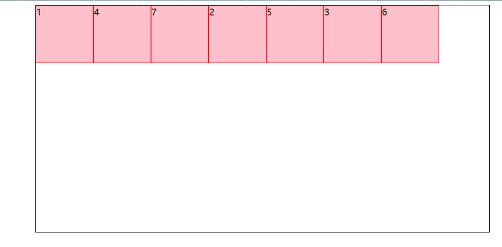

```html
<!DOCTYPE html>
<html lang="en">
<head>
    <meta charset="UTF-8">
    <title>Title</title>
    <style>
        .box {
            width: 800px;
            height: 400px;
            border: 1px solid black;
            margin: auto; /* box 居中*/
            /* 使用弹性布局 */
            display: flex;
            flex-flow: row wrap;

            /* flex-start：与交叉轴的起点对齐。 */
            align-content: flex-start;
            /* flex-end：与交叉轴的终点对齐。 */
            align-content: flex-end;
            /* center：与交叉轴的中点对齐。 */
            align-content: center;
            /* space-between：与交叉轴两端对齐，轴线之间的间隔平均分布。 */
            align-content: space-between;
            /* space-around：每根轴线两侧的间隔都相等。所以，轴线之间的间隔比轴线与边框的间隔大一倍。 */
            align-content: space-around;
             /* stretch（默认值）：轴线占满整个交叉轴。 */
            align-content: stretch;
        }

        .box div {
            width: 100px;
            height: 100px;  /*align-content: stretch  不设置高度*/
            background-color: pink;
            border: 1px solid red;

        }
		 .box div:nth-child(1){
            order: -1;
        }
        .box div:nth-child(2){
            order: 2;
        }
        .box div:nth-child(3){
            order: 4;
        }
        .box div:nth-child(4){
            order: 0;
        }
        .box div:nth-child(5){
            order: 3;
        }
        .box div:nth-child(6){
            order: 7;
        }

    </style>
</head>
<body>
<div class="box">
    <div>1</div>
    <div>2</div>
    <div>3</div>
    <div>4</div>
    <div>5</div>
    <div>6</div>
    <div>7</div>

</div>
</body>
</html>
```

## 3.2 flex-grow属性

```python
# 1 flex-grow属性定义项目的放大比例，默认为0，即如果存在剩余空间，也不放大
# 2 item {  flex-grow: number; /* default 0 */}
# 3 如果所有项目的flex-grow属性都为1，则它们将等分剩余空间（如果有的话）。如果一个项目的flex-grow属性为2，其他项目都为1，则前者占据的剩余空间将比其他项多一倍
```


### 3.2.1 均匀分布

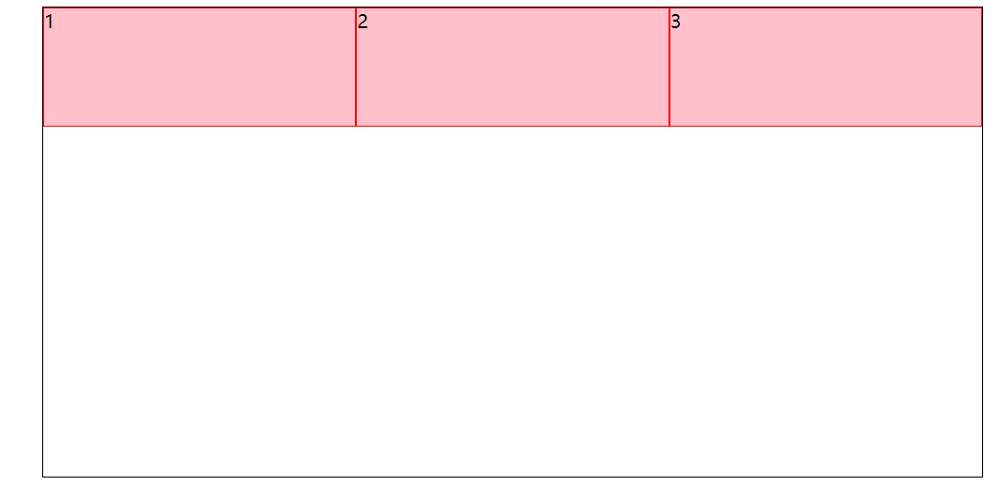

```html
<!DOCTYPE html>
<html lang="en">
<head>
    <meta charset="UTF-8">
    <title>Title</title>
    <style>
        .box {
            width: 800px;
            height: 400px;
            border: 1px solid black;
            margin: auto; /* box 居中*/
            /* 使用弹性布局 */
            display: flex;
            flex-flow: row wrap;

            /* flex-start：与交叉轴的起点对齐。 */
            align-content: flex-start;
            /* flex-end：与交叉轴的终点对齐。 */
            align-content: flex-end;
            /* center：与交叉轴的中点对齐。 */
            align-content: center;
            /* space-between：与交叉轴两端对齐，轴线之间的间隔平均分布。 */
            align-content: space-between;
            /* space-around：每根轴线两侧的间隔都相等。所以，轴线之间的间隔比轴线与边框的间隔大一倍。 */
            align-content: space-around;
            /* stretch（默认值）：轴线占满整个交叉轴。 */
            align-content: stretch;


        }

        .box div {
            width: 100px;
            height: 100px; /*align-content: stretch  不设置高度*/
            background-color: pink;
            border: 1px solid red;

        }

        .box div:nth-child(1) {
            flex-grow: 1;
        }

        .box div:nth-child(2) {
            flex-grow: 1;
        }

        .box div:nth-child(3) {
            flex-grow: 1;
        }

    </style>
</head>
<body>
<div class="box">
    <div>1</div>
    <div>2</div>
    <div>3</div>

</div>
</body>
</html>
```

### 3.2.2 中间占两倍，两边一样大

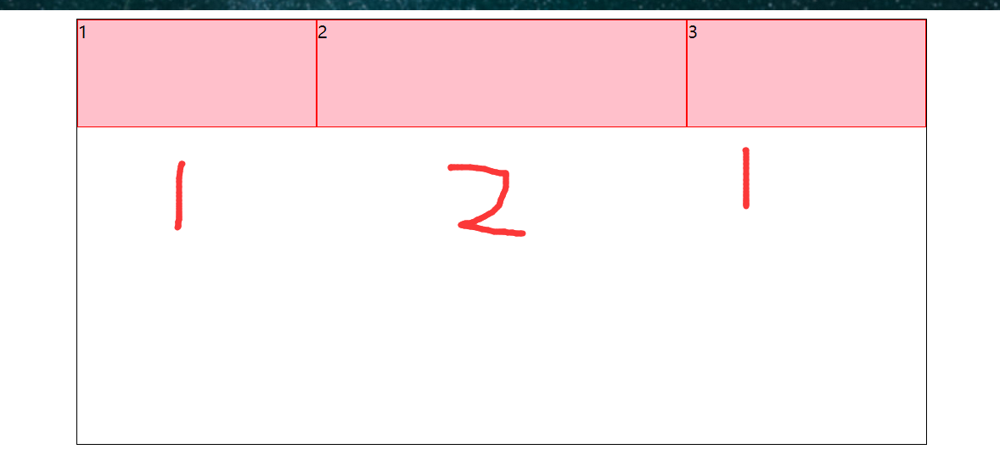

```html
<!DOCTYPE html>
<html lang="en">
<head>
    <meta charset="UTF-8">
    <title>Title</title>
    <style>
        .box {
            width: 800px;
            height: 400px;
            border: 1px solid black;
            margin: auto; /* box 居中*/
            /* 使用弹性布局 */
            display: flex;
            flex-flow: row wrap;

            /* flex-start：与交叉轴的起点对齐。 */
            align-content: flex-start;
            /* flex-end：与交叉轴的终点对齐。 */
            align-content: flex-end;
            /* center：与交叉轴的中点对齐。 */
            align-content: center;
            /* space-between：与交叉轴两端对齐，轴线之间的间隔平均分布。 */
            align-content: space-between;
            /* space-around：每根轴线两侧的间隔都相等。所以，轴线之间的间隔比轴线与边框的间隔大一倍。 */
            align-content: space-around;
            /* stretch（默认值）：轴线占满整个交叉轴。 */
            align-content: stretch;


        }

        .box div {
            width: 100px;
            height: 100px; /*align-content: stretch  不设置高度*/
            background-color: pink;
            border: 1px solid red;

        }

         .box div:nth-child(1){
            flex-grow: 1;
        }
        .box div:nth-child(2){
            flex-grow: 2;
        }
        .box div:nth-child(3){
            flex-grow: 1;
        }


    </style>
</head>
<body>
<div class="box">
    <div>1</div>
    <div>2</div>
    <div>3</div>

</div>
</body>
</html>
```

## 3.3 flex-shrink属性

```python
# 1 flex-shrink属性定义了项目的缩小比例，默认为1，即如果空间不足，该项目将缩小
# 2 .item {  flex-shrink: number; /* default 1 */}
# 3 如果所有项目的flex-shrink属性都为1，当空间不足时，都将等比例缩小。如果一个项目的flex-shrink属性为0，其他项目都为1，则空间不足时，前者不缩小
# 4 负值对该属性无效
```

### 3.3.1 等比例缩小


```html
<!DOCTYPE html>
<html lang="en">
<head>
    <meta charset="UTF-8">
    <title>Title</title>
    <style>
        .box {
            width: 800px;
            height: 400px;
            border: 1px solid black;
            margin: auto; /* box 居中*/
            /* 使用弹性布局 */
            display: flex;
            flex-flow: row nowrap;


        }


        .box div {
            width: 400px;
            height: 100px;
            background-color: pink;
            border: 1px solid red;

        }

 .box div:nth-child(1) {
            flex-shrink: 1;
        }

        .box div:nth-child(2) {
            flex-shrink: 1;
        }

        .box div:nth-child(3) {
            flex-shrink: 1;
        }
        .box div:nth-child(4) {
            flex-shrink: 1;
        }


    </style>
</head>
<body>
<div class="box">
    <div>1</div>
    <div>2</div>
    <div>3</div>
    <div>4</div>

</div>
</body>
</html>
```

### 3.3.2 为0的情况

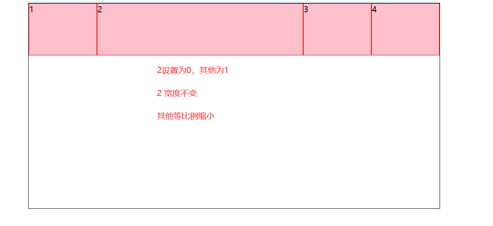

```html
<!DOCTYPE html>
<html lang="en">
<head>
    <meta charset="UTF-8">
    <title>Title</title>
    <style>
        .box {
            width: 800px;
            height: 400px;
            border: 1px solid black;
            margin: auto; /* box 居中*/
            /* 使用弹性布局 */
            display: flex;
            flex-flow: row nowrap;


        }


        .box div {
            width: 400px;
            height: 100px;
            background-color: pink;
            border: 1px solid red;

        }

       .box div:nth-child(1) {
            flex-shrink: 1;
        }

        .box div:nth-child(2) {
            flex-shrink: 0;
        }

        .box div:nth-child(3) {
            flex-shrink: 1;
        }
        .box div:nth-child(4) {
            flex-shrink: 1;
        }


    </style>
</head>
<body>
<div class="box">
    <div>1</div>
    <div>2</div>
    <div>3</div>
    <div>4</div>

</div>
</body>
</html>
```

## 3.4 flex-basis属性

```python
# 1 flex-basis属性定义了在分配多余空间之前，项目占据的主轴空间（main size）。浏览器根据这个属性，计算主轴是否有多余空间。它的默认值为auto，即项目的本来大小
# 2 .item {  flex-basis: length | auto; /* default auto */}
```

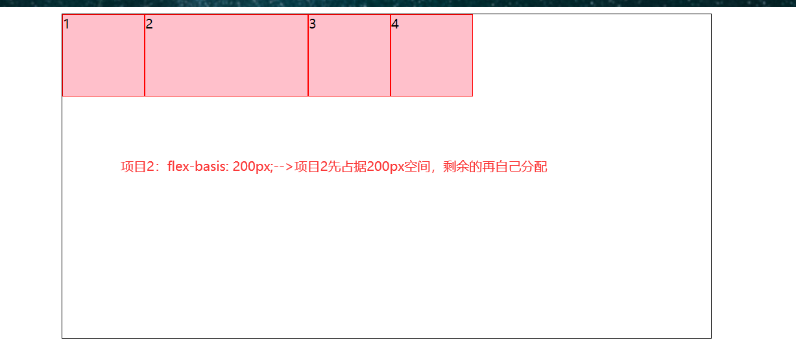

```html
<!DOCTYPE html>
<html lang="en">
<head>
    <meta charset="UTF-8">
    <title>Title</title>
    <style>
        .box {
            width: 800px;
            height: 400px;
            border: 1px solid black;
            margin: auto; /* box 居中*/
            /* 使用弹性布局 */
            display: flex;
            flex-flow: row nowrap;


        }


        .box div {
            width: 100px;
            height: 100px;
            background-color: pink;
            border: 1px solid red;

        }

        .box div:nth-child(2) {
            /* 将项目2的宽度设为200px */
            flex-basis: 200px;
        }


    </style>
</head>
<body>
<div class="box">
    <div>1</div>
    <div>2</div>
    <div>3</div>
    <div>4</div>

</div>
</body>
</html>
```

## 3.5 flex属性

```python

# 1 flex属性是flex-grow, flex-shrink 和 flex-basis的简写，默认值为 0 1 auto。后两个属性可选。

# 2 .item {  flex: none | [ <'flex-grow'> <'flex-shrink'>? || <'flex-basis'> ]}

# 3 该属性有两个快捷值：auto (1 1 auto) 和 none (0 0 auto)。

# 4 建议优先使用这个属性，而不是单独写三个分离的属性，因为浏览器会推算相关值。

# 5 一般情况下flex属性用于将项目平均占满空间

.box div {
    /* 使所有项目平均占满空间 */
    flex: 1;
}

```

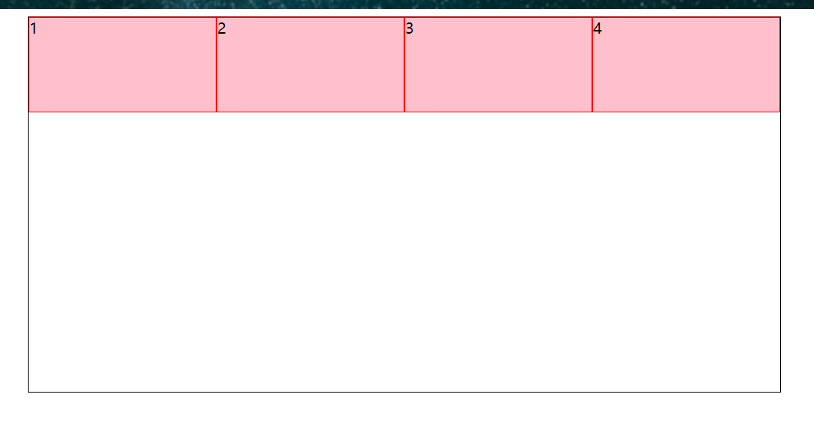

## 3.6 align-self属性
```python
# 1 align-self属性允许单个项目有与其他项目不一样的对齐方式，可覆盖align-items属性。默认值为auto，表示继承父元素的align-items属性，如果没有父元素，则等同于stretch
# 2 .item {  align-self: auto | flex-start | flex-end | center | baseline | stretch;}
# 3 该属性可能取6个值，除了auto，其他都与align-items属性完全一致

```

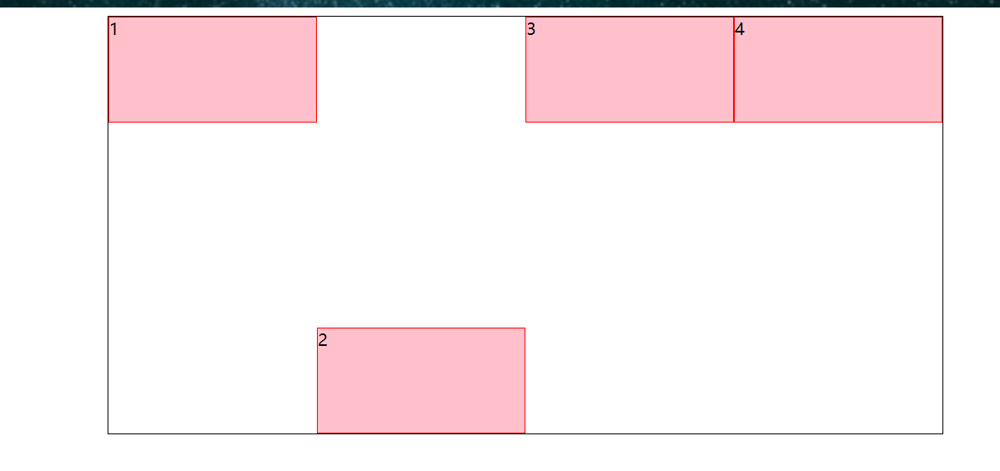

```html
<!DOCTYPE html>
<html lang="en">
<head>
    <meta charset="UTF-8">
    <title>Title</title>
    <style>
        .box {
            width: 800px;
            height: 400px;
            border: 1px solid black;
            margin: auto; /* box 居中*/
            /* 使用弹性布局 */
            display: flex;
            flex-flow: row nowrap;


        }


        .box div {
            width: 100px;
            height: 100px;
            background-color: pink;
            border: 1px solid red;
            flex: 1;

        }
        .box div:nth-child(2) {
            /* 使第二个项目在交叉轴上终点对齐 */
           align-self: flex-end;
        }


    </style>
</head>
<body>
<div class="box">
    <div>1</div>
    <div>2</div>
    <div>3</div>
    <div>4</div>

</div>
</body>
</html>
```

# 四 案例

## 4.1 元素垂直居中

```html
<!DOCTYPE html>
<html lang="en">
<head>
    <meta charset="UTF-8">
    <title>Title</title>
    <style>
        .box {
            width: 800px;
            height: 400px;
            border: 1px solid black;
            margin: auto; /* box 居中*/
            /* 使用弹性布局 */
            display: flex;
             /* 使项目在主轴上中心对齐 */
            justify-content: center;
            /* 使项目在交叉轴上中心对齐 */
            align-items: center;


        }


        .box div {
            width: 100px;
            height: 100px;
            background-color: pink;
            border: 1px solid red;


        }


    </style>
</head>
<body>
<div class="box">
    <div></div>


</div>
</body>
</html>
```

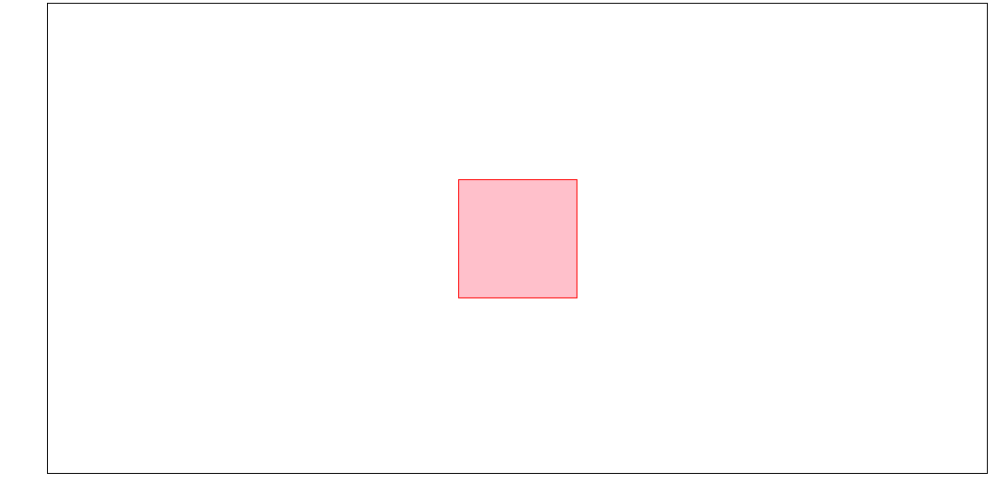

## 4.2 圣杯布局

```python
1.中间内容部分优先加载
2.两侧导航栏宽度固定不变，中间部分自动填充整个区域
```

```html
<!DOCTYPE html>
<html lang="en">
<head>
    <meta charset="UTF-8">
    <title>Title</title>
    <style>
        .box {
            /* 将盒子进行弹性布局 */
            display: flex;
        }

        .left {
            width: 100px;
            height: 200px;
            background-color: green;
            /* 将左边导航栏的order设置最小，这样就可以跑到左边 */
            order: -1;
        }

        .center {
            background-color: pink;
            height: 400px;
            /* 内容区域自动占满剩余空间 */
            flex: 1;
        }

        .right {
            width: 200px;
            height: 200px;
            background-color: yellow;
        }
    </style>
</head>
<body>
<div class="box">
    <div class="center"></div>
    <div class="left"></div>
    <div class="right"></div>
</div>
</body>
</html>
```
![[Pasted image 20251228170753.png]]


## 4.3 小米商城案例


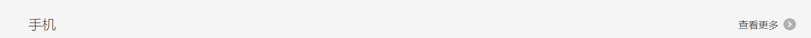

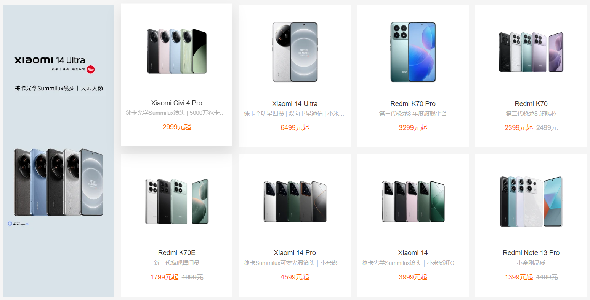

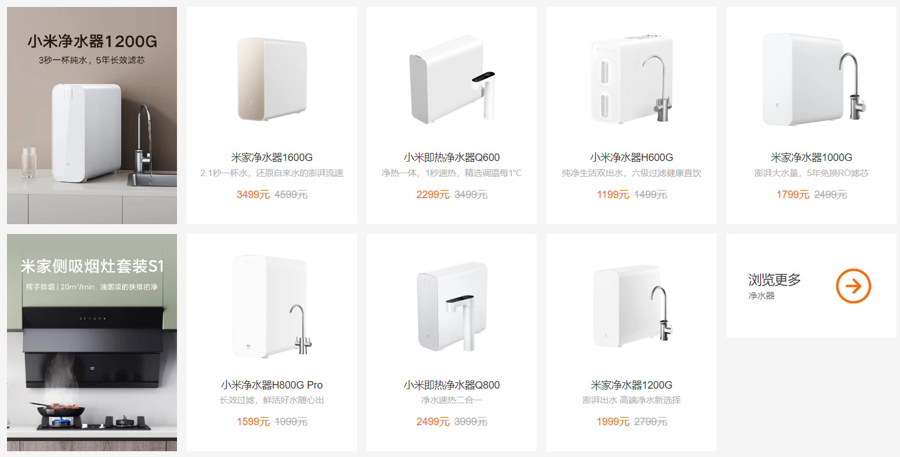

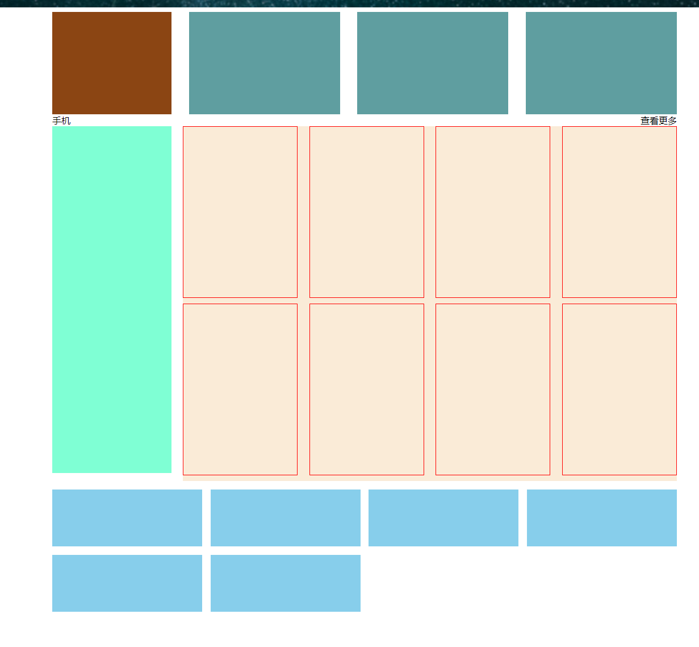


```html
<!DOCTYPE html>
<html lang="en">
<head>
    <meta charset="UTF-8">
    <title>Title</title>
    <style>
        .container {
            width: 1100px;
            margin: 0 auto;
        }

        .row1 {
            display: flex;
            flex-direction: row;
            justify-content: space-between;
        }

        .row1 .company {
            width: 210px;
            height: 180px;
            background-color: saddlebrown;
        }

        .row1 .pic {
            width: 266px;
            height: 180px;
            background-color: cadetblue;
        }

        .row2 .title {
            display: flex;
            flex-direction: row;
            justify-content: space-between;
        }

        .row2 .pic-list {
            display: flex;
            flex-direction: row;
            justify-content: space-between;
        }

        .row2 .pic-list .big {
            background-color: aquamarine;
            height: 610px;
            width: 210px;
            margin-right: 20px;
        }

        .row2 .pic-list .right-list {
            background-color: antiquewhite;
            flex-grow: 1;
        }

        .row2 .pic-list .right-list .group {
            display: flex;
            flex-direction: row;
            justify-content: space-between;
            flex-wrap: wrap;
        }

        .row2 .pic-list .right-list .phone {
            margin-bottom: 10px;
            border: 1px solid red;
            width: 200px;
            height: 300px;
        }

        .course-list {
            display: flex;
            justify-content: space-between;
            flex-wrap: wrap;
        }

        .course-list .item {
            width: 24%;
            height: 100px;
            background-color: skyblue;
            margin-top: 15px;
        }
        /*如果最后一个元素，是第3个，右边距=一个位置 + 所有空白位置/3（有三个空白位置）*/
        .course-list .item:last-child:nth-child(4n - 1) {
            margin-right: calc(24% + 4% / 3);
        }
        .course-list .item:last-child:nth-child(4n - 2) {
            margin-right: calc(48% + 8% / 3);
        }
    </style>
</head>
<body>

<div class="container">

    <div class="row1">
        <div class="company"></div>
        <div class="pic"></div>
        <div class="pic"></div>
        <div class="pic"></div>
    </div>

    <div class="row2">
        <div class="title">
            <div>手机</div>
            <div>查看更多</div>
        </div>

        <div class="pic-list">
            <div class="big"></div>
            <div class="right-list">
                <div class="group">
                    <div class="phone"></div>
                    <div class="phone"></div>
                    <div class="phone"></div>
                    <div class="phone"></div>
                </div>
                <div class="group">
                    <div class="phone"></div>
                    <div class="phone"></div>
                    <div class="phone"></div>
                    <div class="phone"></div>
                </div>
            </div>
        </div>
    </div>

    <div class="course-list">
        <div class="item"></div>
        <div class="item"></div>
        <div class="item"></div>
        <div class="item"></div>
        <div class="item"></div>
        <div class="item"></div>

    </div>
</div>

</body>
</html>
```

