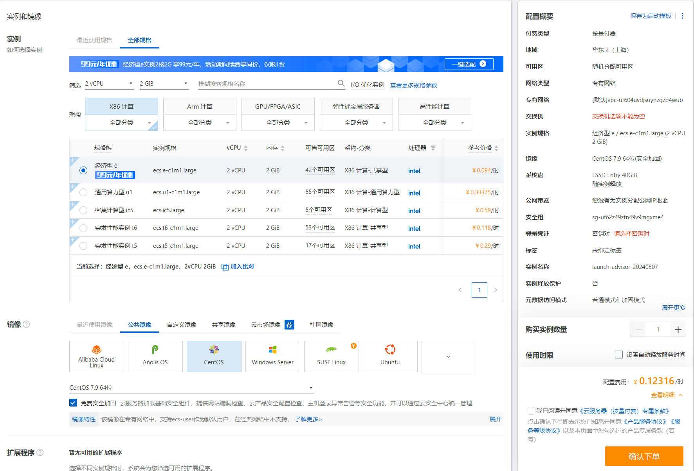
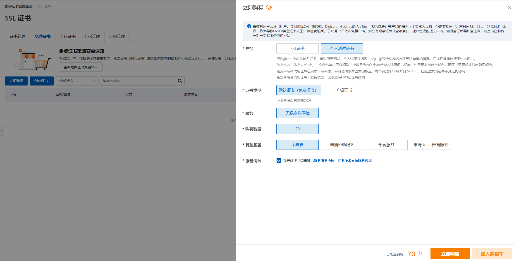
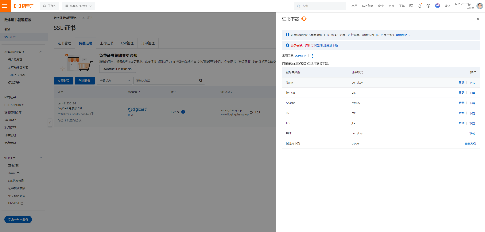
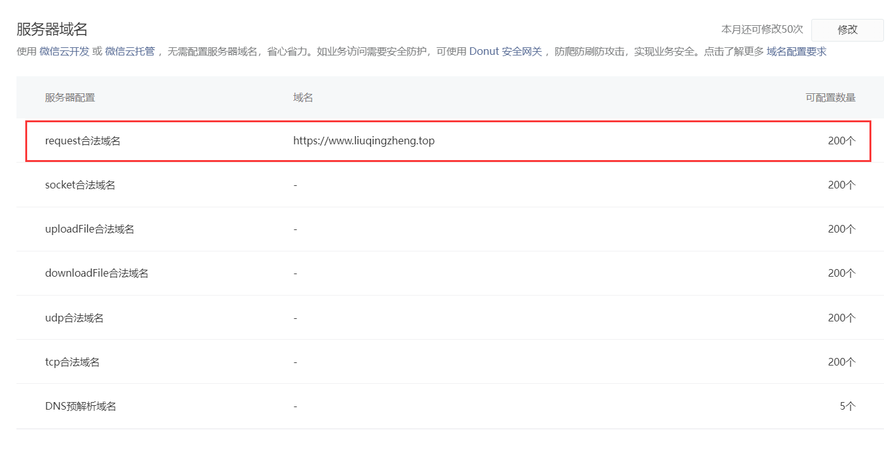
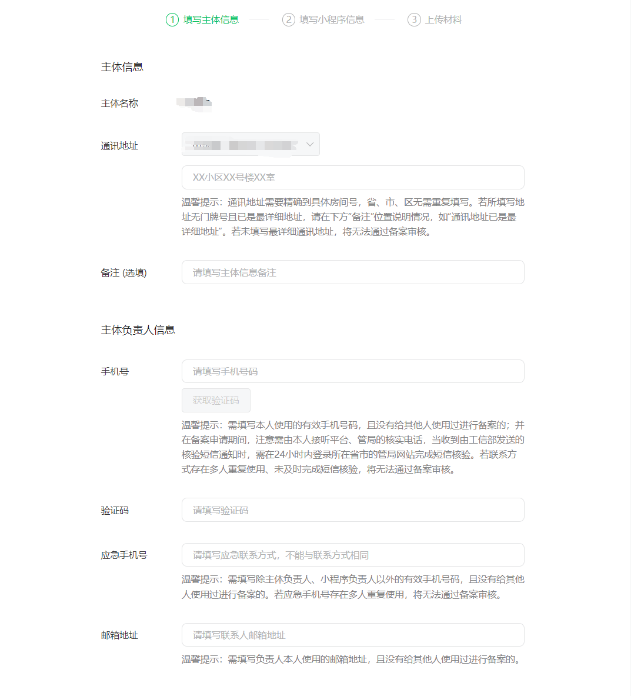

# 一 后端上线

## 1.1 购买云服务器



## 1.2 安装python3.9

```python
# 阿里云的centos上有python环境
	- python2.7.5     pip
  	- python3.6.8     pip3
  
 	-咱们项目开发，在3.9上开发的，需要使用3.9的解释器来运行


# 可以使用yum 安装，不能指定版本（yum install python   咱们不用）
# 源码安装，下载指定版本的源码，编译安装


#### 补充
# 所有linxu和mac，都自带python2：系统服务，是用python写的
# 阿里云的centos默认装了python3.6.8

# python2.7     python3.6.8     python3.9    装模块，不要乱套
   pip             pip             pip

#1  源码安装python，依赖一些第三方zlib* libffi-devel
yum install openssl-devel bzip2-devel expat-devel gdbm-devel readline-devel sqlite-devel psmisc libffi-devel zlib* libffi-devel  -y

# 1前往用户根目录
cd ~

#2 下载  3.9.10 源码 服务器终端
# https://registry.npmmirror.com/binary.html?path=python/
wget https://registry.npmmirror.com/-/binary/python/3.9.10/Python-3.9.10.tgz
# wget https://www.python.org/ftp/python/3.9.16/Python-3.9.16.tgz

#3  解压安装包
tar -xf Python-3.9.10.tgz 

#4 进入目标文件
cd Python-3.9.10

#5  配置安装路径：/usr/local/python3
# 把python3.9.10 编译安装到/usr/local/python38路径下
./configure --prefix=/usr/local/python39

#6  编译并安装,如果报错，说明缺依赖
yum install openssl-devel bzip2-devel expat-devel gdbm-devel readline-devel sqlite-devel psmisc libffi-devel zlib* libffi-devel  -y
# make只是编译----》可执行文件，没有安装
# 类似于在win上下载了安装包，但是没安装
# make install 安装---》类似于在win上下了安装包，一路下一步安装了，指定安装位置---》/usr/local/python39
make &&  make install

#7  建立软连接：/usr/local/python38路径不在环境变量，终端命令 python3，pip3
ln -s /usr/local/python39/bin/python3 /usr/bin/python3.9
ln -s /usr/local/python39/bin/pip3 /usr/bin/pip3.9

# 机器上有多个python和pip命令，对应关系如下
python       2.x      pip 
python3      3.6      pip3
python3.9    3.9      pip3.9

#8  删除安装包与文件：
rm -rf Python-3.9.10
rm -rf Python-3.9.10.tar.xz
```


## 1.3 安装nginx

```python
# 软件：反向代理服务器  （搜一下：什么是正向代理，什么是反向代理）  反向带代理服务器
  - 做请求转发    （前端来了个请求---》打在了80端口上---》转到本地8888端口，或者其他机器的某个端口）
  - 静态资源代理    前端项目直接放在服务器上某个位置----》请求来了，使用nginx拿到访问的内容，直接返回
  - 负载均衡       假设来了1000个请求--》打在nginx上，nginx性能很高，能顶住---》只转发到某个django项目，可能顶不住---》集群化的不是3台django---》均匀的打在3台机器上
    

    
    
# 前往用户根目录
cd ~

#下载nginx 1.24.0
 wget http://nginx.org/download/nginx-1.24.0.tar.gz

#解压安装包
tar -xf nginx-1.24.0.tar.gz

#进入目标文件
cd nginx-1.24.0

# 配置安装路径：/usr/local/nginx
./configure --prefix=/usr/local/nginx --with-http_ssl_module

#编译并安装
 make &&  make install

# 建立软连接：终端命令 nginx
ln -s /usr/local/nginx/sbin/nginx /usr/bin/nginx 

#删除安装包与文件：
cd ~
rm -rf nginx-1.13.7
rm -rf nginx-1.13.7.tar.xz

# 测试Nginx环境，服务器运行nginx，本地访问服务器ip
nginx   # 启动nginx服务，监听80端口----》公网ip 80 端口就能看到页面了
服务器绑定的域名 或 ip:80

# 静态文件放的路径
/usr/local/nginx/html

# 查看进程
ps aux | grep nginx


# 关闭和启动
关闭：nginx -s stop 
启动： nginx


# 它有配置文件---》配置监听那些地址，配置代理那些静态文件---》还没讲
```

## 1.4 安装mysql 5.7

```python
# mysql 5.7 
#1 前往用户根目录

# pwd  查看我在哪个目录下
# cd 切换到某个路径下
 cd ~  # 回到家路径

#2 下载mysql57 
wget http://dev.mysql.com/get/mysql57-community-release-el7-10.noarch.rpm
# ls  查看当前目录下的文件和文件夹

#3 安装mysql57
 yum -y install mysql57-community-release-el7-10.noarch.rpm
 yum install mysql-community-server --nogpgcheck -y

#4 启动mysql57并查看启动状态
systemctl start mysqld  # 启动mysql服务
systemctl status mysqld  # 查看mysql状态

#5 查看默认密码并登录（第一次安装，root密码是随机的）
# 去/var/log/mysqld.log 中过滤出包含 password 的多行
grep "password" /var/log/mysqld.log   # o9H0rTt3zx<;
mysql -uroot -p

#6 修改root密码
 ALTER USER 'root'@'localhost' IDENTIFIED BY 'Lqz12345?';
 grant all privileges on *.* to 'root'@'%' identified by 'Lqz12345?';
 如果还连不上，就是mysql 3306的安全组没开---》防火墙端口没开
  
  
# 7 远程连接：win---》navicate--》
	连接成功
    
    
# 8 安装mysqlclient
yum install python3-devel -y
yum install mysql-devel --nogpgcheck -y
pip3.9 install mysqlclient

# 9
pip3.9 install urllib3==1.26.15
pip3.9 install chardet

#10 
mkdir static
STATIC_ROOT = '/root/smart_backend/static/'


```

## 1.5 编写uwsig配置文件

```python
#1 smart.xml
<uwsgi>    
	<socket>127.0.0.1:8080</socket>
    <chdir>/root/smart_backend/</chdir>  
    <module>smart_backend.wsgi</module>
    <processes>4</processes>
    <daemonize>uwsgi.log</daemonize>
</uwsgi>

#2 安装uwsgi 
pip3.9 install uwsgi
ln -s /usr/local/python39/bin/uwsgi /usr/bin/uwsgi

# 3 启动uwsgi
uwsgi -x smart.xml

# 4 查看
ps aux |grep uwsgi

# 5 停止
pkill -9 uwsgi
```


## 1.6 上传项目

```python
#1 修改配置文件配置文件
DEBUG = False
ALLOWED_HOSTS = ['*']
##数据库配置##
##后台地址 ---》同步修改之前写死的后端地址--》views中
BACKEND_URL='http://127.0.0.1:8000'

#2 生成依赖
pip install pipreqs
pipreqs ./ --encoding=utf-8

baidu_aip==4.16.13
Django==3.2.22
djangorestframework==3.14.0
djangorestframework_simplejwt==5.3.1
Faker==25.0.1
pypinyin==0.51.0
SpeechRecognition==3.10.3
tencentcloud_sdk_python==3.0.1115
mysqlclient

#3 服务器 安装上传和解压模块
yum install lrzsz unzip -y

#4 上传项目
rz

#5 服务器安装依赖
# mysqlclient
yum install python3-devel -y
yum install mysql-devel --nogpgcheck -y
pip install mysqlclient

#6 出现错误：ImportError: urllib3 v2.0 only supports OpenSSL 1.1.1+, currently the 'ssl'
pip install urllib3==1.26.15 
```


## 1.7 nginx 配置（http访问）

```python
# 6 配置nginx转发
cd /usr/local/nginx/conf
vi nginx.conf
# 新增的server
events {
    worker_connections  1024;
}
http {
    include       mime.types;
    default_type  application/octet-stream;
    sendfile        on;
	server {
        listen 8000;
        server_name  127.0.0.1;
        charset utf-8;
        location / {
            include uwsgi_params;
            uwsgi_pass 127.0.0.1:8080;
            uwsgi_param UWSGI_SCRIPT smart_backend.wsgi; 
            uwsgi_param UWSGI_CHDIR /root/smart_backend/;
            }
        }
       location /static {
            alias /home/static;
       }
}


# 重启nginx 
nginx -s reload
```

### 1.7.1 安全组 配置

```python
安全组-云服务器
```


## 1.8 配置admin访问

```python

# http://47.116.207.103:8000/static/rest_framework/css/bootstrap.min.css

#  1 后端项目，使用uwsgi部署完成，可以访问动态接口，但不能访问静态资源

# 2 uwsgi为了提高效 率，只处理动态请求，静态资源的获取，不管
	-静态资源就是在从服务器把文件，图片，js，css，直接返回
    -如果静态资源也走uwsgi，会影响uwsgi的性能
  
  10     2 个动态接口    8个 拿静态资源
  				usgi只负责处理这两个动态接口
    			静态资源不管---》自行处理
      
      
# 3 动静分离
	-动态请求给uwsgi---》让它处理---》uwsgi资源宝贵，尽量少用
  	动态请求地址： /api/v1....
    -静态请求，使用nginx，直接处理---》nginx来讲，最擅长处理静态资源
  		静态资源地址： /static/...
    
    
# 4 请求发送到nginx监听的 8000 端口上的时候，判断 如果是 / --->转发给uwsgi  ，如果是 /static--->直接去固定的位置，把静态资源直接返回，不走uwsgi了，节约uwsgi的性能


# 5 配置nginx，做静态文件代理---》收集静态资源
	-simpleui
  	-drf   
  	-都在自己app中，我们需要把他们单独收集到某个位置
  
  
  -后期如果部署前后端混合项目必须要做动静分离，收集静态文件
  
  
  
  
# 6 操作步骤

#6.1  收集静态资源，使用nginx代理
# prod.py中加入   把静态资源收集到这个文件夹下
STATIC_ROOT = '/home/smart/static/'


# 6.2 进入虚拟环境
mkdir /home/smart/static
python manage_pro.py collectstatic


http://106.14.156.208:8000/static/admin/simpleui-x/img/logo.png


# 6.3 修改nginx配置文件
# 新增的配置静态文件

server {

        location /static {
            alias /home/static;
       }
      }
 
 # 6.4 重启nginx
	nginx -s reload
  
```


## 1.9 阿里云证书

```python
https://yundun.console.aliyun.com/?spm=5176.12818093_47.top-nav.23.57ea16d02gIoxM&p=cas#/certExtend/free/cn-hangzhou
    
#https://help.aliyun.com/zh/ssl-certificate/user-guide/install-ssl-certificates-on-nginx-servers-or-tengine-servers?spm=0.2020520163.0.0.1c20J0IlJ0IlNH
```





### 1.9.1 配置https访问

```python
events {
    worker_connections  1024;
}
http {
    include       mime.types;
    default_type  application/octet-stream;
    sendfile        on;
    client_max_body_size 20M;
	server {
    	listen 443 ssl;
     	ssl_certificate /usr/local/nginx/cert/liuqingzheng.top.pem;
     	ssl_certificate_key /usr/local/nginx/cert/liuqingzheng.top.key;
        server_name  liuqingzheng.top;
        location / {
            include uwsgi_params;
            uwsgi_pass 127.0.0.1:8080;
            uwsgi_param UWSGI_SCRIPT smart_backend.wsgi;
            uwsgi_param UWSGI_CHDIR /root/smart_backend/;
            }

       location /static {
            alias /home/static;
       }
    }
}
```

## 1.10 购买域名-备案-配置域名解析

```python
# 1 购买域名

# 2 备案

# 3 配置解析
https://dc.console.aliyun.com/next/index?spm=5176.12818093_47.top-nav.40.3be916d0be3QME#/overview
```


# 二 小程序上线

```python
# 1 小程序后台
https://mp.weixin.qq.com/wxamp/home/guide?lang=zh_CN&token=1879741752
 
#2  修改小程序地址
const rootUrl = 'https://www.liuqingzheng.top/smart'

# 3 上传，设为体验版,配置体验成员--测试

# 4 备案，提交审核，等待审核通过
```




